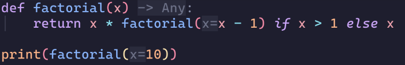
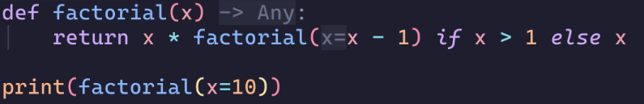

# Inlayhint-filler.nvim 
> This plugin works as long as the neovim inlayhint API doesn't change.
> Please don't consider this orphaned simply because you see the last commit was made 
> a long time ago.

For some languages like Python, the inlay-hint provided by the language server
are actually optional symbols/tokens that can be inserted into the buffer. 
This plugin provides an API to insert the inlay-hint under the cursor into the
buffer.
In Python, this is useful when you want to insert the type annotation from the
language server into the code, or you want to turn an unnamed argument (`f(10)`)
into a named argument (`f(x=10)`) (_particularly useful when working with
functions that takes dozens of arguments_).

## Installation 

This plugin is developed and tested on the latest stable release of neovim.

Use your favourite plugin manager.
```lua
{
    "Davidyz/inlayhint-filler.nvim",
    keys={
        {
            "<Leader>I", -- Use whatever keymap you want.
            function()
                require("inlayhint-filler").fill()
            end,
            desc = "Insert the inlay-hint under cursor into the buffer."
        }
    }
}
```

## Usage 
Suppose you have a python code snippet like this:

```python
def factorial(x):
    return x * factorial(x - 1) if x > 1 else x

print(factorial(10))
```

A language server with inlay hint support, like [basedpyright](https://github.com/DetachHead/basedpyright), and enabled inlay-hint in your neovim config, neovim will render the buffer into something like this:


If you put your cursor next to the inlay hint `x=` in the last line (either on
the left parenthesis or on `1`) and call
the Lua function `require("inlayhint-filler").fill()`, it'll grab the inlay hint
and convert the virtual text into actual code in the buffer:


### Language server support
This plugin is supposed to be language-server-agnostic, but if you encounter any
issues with a specific language/language server, please open an issue (preferably
following the issue template for bug report).

## Todo 
- [ ] implement support for visual selection mode.
